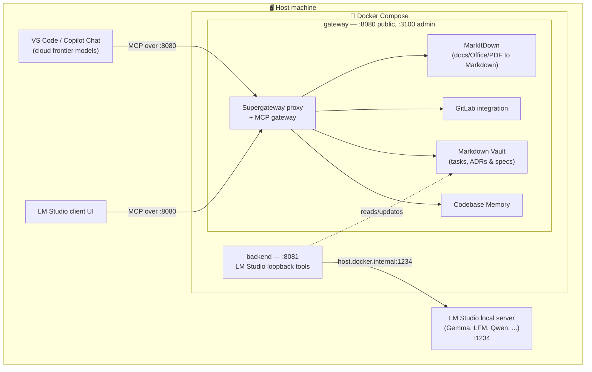

# VS Code MCP Supergateway

A centralized, multi-client Model Context Protocol (MCP) gateway that aggregates, routes, and offloads context between IDE clients, local LLM workers, and backend MCP services.

---

## 💡 Overview & Value Proposition

As MCP usage grows, managing multiple disjointed MCP servers across different clients (VS Code/Copilot, LM Studio, etc.) becomes cumbersome. **VS Code MCP Supergateway** acts as a unified hub:

1. **Multiplexing & Routing:** Connect multiple clients to a single, orchestrated MCP endpoint.
2. **Context & Token Savings:** Keep expensive Frontier Model context clean by delegating repetitive context-structuring tasks to local worker models.
3. **LM Studio Loopback Pattern:** Turn LM Studio into both an MCP consumer *and* a high-speed local MCP tool/worker for tasks like documentation linting, diff summarization, and task management.

---

## 🏗 Architecture

Everything except your IDE and LM Studio runs inside Docker — the containers bring their own Node.js, Python, and all four upstream MCP servers.



---

## 🚀 Quick Start

### 1. Prerequisites

- [Docker](https://www.docker.com/) — Docker Desktop on Windows/macOS. **This is the only requirement.** Node.js, Python, and every upstream MCP server are bundled inside the image; nothing is installed on your host.
- [VS Code](https://code.visualstudio.com/) with GitHub Copilot — the client that will consume the gateway.
- [LM Studio](https://lmstudio.ai/) — optional, only for local model offloading & the loopback tools.

### 2. Clone and configure

```bash
git clone https://github.com/Flexi23/vscode-mcp-supergateway.git
cd vscode-mcp-supergateway
cp .env.example .env
```

Then edit [`.env`](.env.example):

| Variable | Required | Purpose |
|---|---|---|
| `GITLAB_PERSONAL_ACCESS_TOKEN` | for the `gitlab` upstream | Injected into the `gitlab` upstream by [`src/gateway.ts`](src/gateway.ts). Without it that upstream fails to connect and its tools are missing from the admin UI. |
| `LMSTUDIO_BASE_URL` | for the loopback tools | Defaults to `http://host.docker.internal:1234/v1`. Inside a container `localhost` means *the container*, so a host-side LM Studio must be reached via `host.docker.internal` (Docker Desktop only). |

### 3. Start

```bash
docker compose up -d --build
```

The first build takes a while and produces a ~2.9 GB image — see [🐳 Operations](#-operations) for why.

### 4. Connect VS Code

Point your MCP client config at the gateway's public port:

```json
{
  "servers": {
    "central-mcp-gateway": {
      "type": "sse",
      "url": "http://localhost:8080/sse"
    }
  }
}
```

Verify it came up:

```bash
curl http://localhost:8080/ping     # -> ok
docker compose logs gateway         # -> [upstream:*] connected (stdio) x4
```

The admin UI lives at <http://localhost:3100/admin>.

---

## 📦 Services & Ports

Both services are built from the same image (`vscode-mcp-supergateway-backend:local`), defined in [`docker-compose.yml`](docker-compose.yml):

| Service | Command | Ports | What it is |
|---|---|---|---|
| `gateway` | `node dist/gateway.js` | `8080` public, `3100` admin UI + direct MCP endpoint | The full multi-upstream MCP gateway (`@mspstack/mcp-gateway` plus all four upstreams below), everything bundled in the image. |
| `backend` | `node dist/server.js` | `8081` | The Express LM Studio loopback backend (`lmstudio_complete`, `lmstudio_summarize_diff`, `lmstudio_update_vault_task`). Deliberately on a *different* port than `gateway` — `8080` is the port your MCP client connects to, so squatting it here would silently break that connection. |

---

## 🔌 Configured Upstreams

All four run inside the `gateway` container; the runtime column only says which language runtime the image provides for them.

| Upstream | Package | Runtime | Notes |
|---|---|---|---|
| `codebase-memory` | `codebase-memory-mcp` | Node | Auto-index off by default; own UI on port 9749. |
| `markdown-vault` | `@wirux/mcp-markdown-vault` | Node | `VAULT_PATH` env var; vault directory is auto-created on start if missing. |
| `gitlab` | `@zereight/mcp-gitlab` | Node | Requires `GITLAB_PERSONAL_ACCESS_TOKEN` (see [Quick Start](#2-clone-and-configure)). |
| `markitdown` | [`markitdown-mcp`](https://pypi.org/project/markitdown-mcp/) | Python | Exposes a single tool, `convert_to_markdown(uri)`, for `http:`, `https:`, `file:`, and `data:` URIs. |

Upstream wiring lives in [`docker/gateway.config.json`](docker/gateway.config.json).

---

## ⚡ Key Features & Concepts

- **Unified Control Plane:** Connect Copilot and LM Studio simultaneously to your underlying toolchain (GitLab, Codebase Memory, Vault, MarkItDown).
- **Sub-Agent Loopback:** Offload context aggregation, diff generation, and documentation updates to fast local models running in LM Studio without consuming cloud tokens.
- **Markdown Vault Integration:** Structure project tasks, architectural decision records (ADRs), and feature specs directly in markdown files guarded by YAML access controls (`agent_access`).
- **Document Conversion:** [MarkItDown](https://github.com/microsoft/markitdown) upstream exposes `convert_to_markdown(uri)`, turning PDFs, Office documents, images, and other files into Markdown for downstream agent consumption.

---

## 🐳 Operations

```bash
docker compose up -d --build   # start (rebuilds if needed)
docker compose logs -f gateway # follow gateway logs
docker compose down            # stop and remove
```

Notes:
- **Data persistence:** the vault and gateway DB live in named volumes (`gateway-vault`, `gateway-data`), not bind mounts — inspect with `docker compose exec gateway sh`.
- **Node ≥24 required:** `@mspstack/mcp-gateway` declares it in its `engines` field, so [`Dockerfile`](Dockerfile) uses `node:24-alpine` (builder) / `node:24-bookworm-slim` (runtime). Do not downgrade to `node:20`.
- **Image size (~2.9 GB):** caused by Python's `markitdown[all]` (onnxruntime, pandas, azure SDKs, ...) plus ~330 Node packages. Accepted trade-off for having zero host-level dependencies.
- **Slow `docker compose build`?** Because both services share one image name, Compose builds the targets separately. A single `docker build -t vscode-mcp-supergateway-backend:local .` is often noticeably faster.

---

## 🛠 Developing on this repo

Only relevant if you change the TypeScript sources. The image compiles `src/` itself during `docker compose build`, so you never need a host-side build to *run* anything — a local install is purely for editor IntelliSense and fast type-check feedback:

```bash
npm install          # type definitions for your editor
npx tsc --noEmit     # type-check without producing dist/
```

Then rebuild the image to pick up your changes:

```bash
docker compose up -d --build
```

---

## 🗺 Roadmap & Future Plan

### Phase 1: MVP & Core Gateway (Current)
- [x] Basic stdio / SSE transport routing.
- [x] Multi-backend server orchestration (Codebase Memory, GitLab, Vault).
- [x] Initial agent-assisted development groundwork.

### Phase 2: LM Studio Loopback & Context Worker
- [ ] Implement local LM Studio MCP tool wrapper (`summarize_diff`, `generate_adr`).
- [ ] Add zero-blocking async tool handling for local inference.
- [ ] Graceful fallback & timeout management when local GPUs are under heavy load.

### Phase 3: Vault & Task Management Enhancements
- [ ] Standardized YAML-Frontmatter parser for Markdown Vault (`tasks/`, `adrs/`).
- [ ] Agent scope security layer (`agent_access: read | append | edit | hidden`).
- [ ] Automated context bundle generator for Copilot prompts.

---

## 📄 License

MIT License. Feel free to contribute or adapt!

---

## 🧪 Disclaimer

Parts of this repository were deliberately generated with small local LLMs rather than a single frontier model — quality and style vary accordingly between commits. See individual commit messages for which model produced each change.