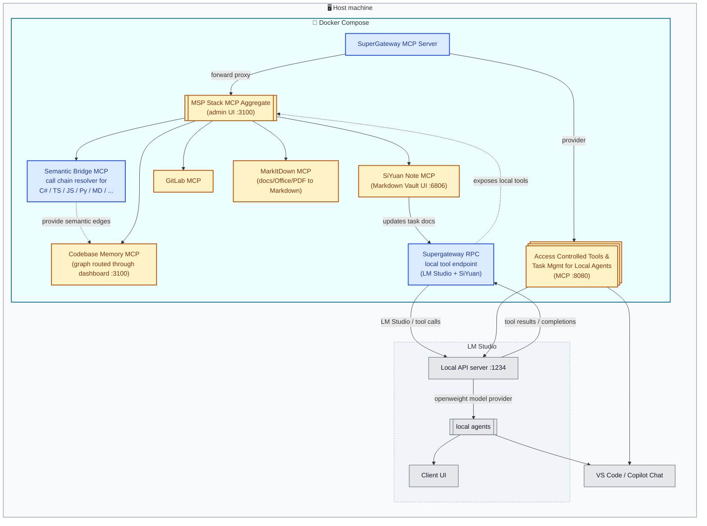

# VS Code MCP Supergateway

A centralized, multi-client Model Context Protocol (MCP) gateway that aggregates, routes, and offloads context between IDE clients, local LLM workers, and backend MCP services.

---

## 💡 Overview & Value Proposition

As MCP usage grows, managing multiple disjointed MCP servers across different clients (VS Code/Copilot, LM Studio, etc.) becomes cumbersome. **VS Code MCP Supergateway** acts as a unified hub:

1. **Multiplexing & Routing:** Connect multiple clients to a single, orchestrated MCP endpoint.
2. **Context & Token Savings:** Keep expensive Frontier Model context clean by delegating repetitive context-structuring tasks to local worker models.
3. **LM Studio Loopback Pattern:** Turn LM Studio into both an MCP consumer *and* a high-speed local MCP tool/worker for tasks like documentation linting, diff summarization, and task management.

---

## 🏗 Architecture

Everything except your IDE and LM Studio runs inside Docker — the containers bring their own Node.js, Python, and the current set of six upstream MCP servers.



Legend: 🟦 blue = this repo's code entry points (click to open the source file) · 🟨 amber = third-party MCP servers/packages (click for npm/PyPI page) · ⬜ grey = host-side applications you already run (VS Code, LM Studio). Subgraph backgrounds: outer host boundary in slate, the LM Studio group dashed, the Docker Compose boundary in cyan.

---

## 🧭 Canonical project policy

This README is the canonical project-facing reference for users and developers. It describes the supported runtime, environment files, dependency policy, and operational conventions for this repository.

The local agent instructions file in this repo is a reminder layer for AI tools and contributors. It exists to keep agents aligned with the project rules, but it is not a second source of truth. When a task touches project policy, dependency pinning, environment setup, or operational conventions, the agent must re-read the relevant README section and use it as the authoritative source.

For reproducibility, direct dependency versions in [`package.json`](package.json) must be pinned to exact versions instead of ranges, and paired packages such as `ws` and `@types/ws` must stay in sync in the same change. This prevents silent drift between developer machines, CI, and the runtime image.

---

## 🚀 Quick Start

### 1. Prerequisites

- [Docker](https://www.docker.com/) — Docker Desktop on Windows/macOS. **This is the only requirement.** Node.js, Python, and every upstream MCP server are bundled inside the image; nothing is installed on your host.
- [VS Code](https://code.visualstudio.com/) with GitHub Copilot — the client that will consume the gateway.
- [LM Studio](https://lmstudio.ai/) — optional, only for local model offloading & the loopback tools.

### 2. Clone and configure

```bash
git clone https://github.com/Flexi23/vscode-mcp-supergateway.git
cd vscode-mcp-supergateway
cp .env.example .env
```

Then edit [`.env`](.env.example):

| Variable | Required | Purpose |
|---|---|---|
| `GITLAB_API_URL` | **required** for the `gitlab` upstream | Base URL for the GitLab REST API, for example `https://gitlab.uni-rostock.de/api/v4`. |
| `GITLAB_PERSONAL_ACCESS_TOKEN` | for the `gitlab` upstream | Injected into the `gitlab` upstream by [`src/gateway.ts`](src/gateway.ts). Without it that upstream fails to connect and its tools are missing from the admin UI. |
| `SIYUAN_TOKEN` | optional for the `siyuan-note` upstream | SiYuan API token (SiYuan: Settings -> About -> API Token). For local/dev mode you can leave it empty and set `SIYUAN_TOKEN_REQUIRED=false`; the upstream then talks to the kernel without an `Authorization` header. |
| `SIYUAN_TOKEN_REQUIRED` | optional | When set to `true`, the gateway warns if the token is empty or a placeholder; otherwise token auth is disabled and the upstream works without one. |
| `SIYUAN_ACCESS_AUTH_CODE` | optional for the `siyuan` service | Lock-screen / access password for the SiYuan container's own web UI at <http://localhost:6806>. This is the variable the current compose stack consumes. |
| `SIYUAN_ACCESS_AUTH_CODE_BYPASS` | optional | Set to `true` to allow the local SiYuan container to start without an explicit auth code in a dev setup. |
| `SIYUAN_WORKSPACE_DIR` | **required** | Absolute host path to the SiYuan workspace directory, mounted directly at `/siyuan/workspace` inside the `siyuan` container. This is intentionally independent from the Codebase Memory paths. |
| `CBM_HOST_DATA_DIR` | **required** | Absolute host path for the gateway runtime data directory (the `gateway.db` and admin config), mounted into the `gateway` container at `/app/data`. This is separate from the CBM cache. |
| `CBM_HOST_WORKSPACE_DIR` | **required** | Absolute host path on the machine that is mounted read-only into the `gateway` container at `/workspace`. This is the host-side source for the workspace tree Codebase Memory should browse. |
| `CBM_AUTO_INDEX_ENABLED` | optional | Set to `true` to enable the startup auto-index; otherwise startup indexing stays off and `CBM_AUTO_INDEX_PATH` is ignored. |
| `CBM_AUTO_INDEX_PATH` | only when enabled | Linux container path used for startup indexing. The runtime default is `/workspace`, not a Windows host path. |
| `CBM_DEFAULT_PATH` | **required** | Linux container path that Codebase Memory opens by default in its UI. Keep this as `/workspace` so the UI sees the same root that the bind mount exposes. |
| `CBM_HOST_CACHE_DIR` | **required** | Absolute host path for the bind mount that Codebase Memory uses as its writable cache; it is mounted into the `gateway` container at `/root/cbm-cache`. The internal runtime variable inside the container remains `CBM_CACHE_DIR`. |
| `LMSTUDIO_BASE_URL` | for the loopback tools | Defaults to `http://host.docker.internal:1234/v1`. Inside a container `localhost` means *the container*, so a host-side LM Studio must be reached via `host.docker.internal` (Docker Desktop only). |
| `MARKDOWN_VAULT_ROOT` | **required** for repo-local help docs | Absolute path to the git-tracked markdown vault root, for example `C:\gitlab.uni-rostock.de\limati-inf\vscode-mcp-supergateway\vault`. This keeps the online help and local notes inside the project so the integrated MCP tools can read and update them without leaving the repository. |

### 3. Start

```bash
docker compose up -d --build
```

The first build takes a while and produces a ~2.9 GB image — see [🐳 Operations](#-operations) for why.

### 4. Connect VS Code

Point your MCP client config at the gateway's public port:

```json
{
  "servers": {
    "central-mcp-gateway": {
      "type": "sse",
      "url": "http://localhost:8080/sse"
    }
  }
}
```

Verify it came up:

```bash
curl http://localhost:8080/ping     # -> ok
docker compose logs gateway         # -> [upstream:*] connected (stdio) x6
```

The local dashboard lives at <http://localhost:3100/> and exposes the Codebase Memory overview, project indexing/status, and the graph UI through the same routed frontend. The public MCP endpoint remains on port `8080`; the dashboard stays on port `3100`, and the legacy browser routes are no longer exposed.

> Port numbers are a strict `.env` concern: every published and internal port must be declared in [.env](.env) and consumed in [`docker-compose.yml`](docker-compose.yml) as `${VAR}`. No numeric port literals are used as a second source of truth.

---

## 📦 Services & Ports

`gateway.ts` and `server.ts` run as a single Node process in a single container (`vscode-mcp-supergateway-backend:local`), started via `node dist/gateway.js` (see [`docker-compose.yml`](docker-compose.yml)). `gateway.ts` imports and starts `server.ts`'s Express app directly instead of spawning a second container.

| Port | What it is |
|---|---|
| `8080` | Public MCP endpoint — the forward proxy your MCP client (Copilot/LM Studio) connects to. SSE/MCP traffic only; the dashboard is not served here. |
| `3100` | Local dashboard overview for Codebase Memory project indexing/status, including the routed graph UI. The CBM interface is served through the web frontend instead of a separate public port. |

The LM Studio loopback's `lmstudio_update_siyuan_task` tool reads/writes SiYuan documents directly via `SiyuanClient` (`src/services/siyuanClient.ts`), the same backend the `siyuan-note` upstream talks to (see [Configured Upstreams](#-configured-upstreams)).

### What is `@mspstack/mcp-gateway`?

[`@mspstack/mcp-gateway`](https://www.npmjs.com/package/@mspstack/mcp-gateway) ("MSPStack Gateway", MIT-licensed, by [Eugene Samotija](https://github.com/selic)) is a third-party, self-hosted MCP aggregator: it federates any number of MCP servers (stdio or HTTP) behind one endpoint with namespaced tools, and normally adds OAuth 2.1 / static-token auth, role-based tool access, and secret-store integration (OpenBao, Azure Key Vault) on top — built for MSPs running many client-facing MCP servers.

`src/gateway.ts` spawns it via `npx -y @mspstack/mcp-gateway --port <admin-port> --config <admin-config> --db-path <db>` and sets `DEV_ALLOW_UNAUTHENTICATED=true`, which puts it in its documented localhost-only, no-auth mode — we use its core aggregation feature to expose one MCP endpoint for our six stdio upstreams, without the OAuth/RBAC/secret-store machinery. `DEV_ALLOW_UNAUTHENTICATED=true` must **never** be used on anything but `127.0.0.1`/localhost; the package itself refuses to start without it or a real auth method configured. Requires Node ≥24 (uses the built-in `node:sqlite`, no native dependencies) — see the Node version note below.

---

## 🔌 Configured Upstreams

All six upstreams run inside the `gateway` container; the runtime column only says which language runtime the image provides for them.

| Upstream | Package | Runtime | Notes |
|---|---|---|---|
| `codebase-memory` | `codebase-memory-mcp` | Node | Auto-indexes the container-side `CBM_AUTO_INDEX_PATH` on startup (typically `/workspace`), uses `CBM_DEFAULT_PATH` for the routed workspace view, and exposes its graph through the same dashboard port `3100` while sharing `CBM_CACHE_DIR` with the routed UI process. There is no separate CBM UI port configuration. |
| `semantic-bridge` | local bridge | Node | Exposes C#, TypeScript, and Python workspace/file enumeration plus dependency/call-chain graph extraction via the stdio MCP server in [`src/semanticBridgeMcp.ts`](src/semanticBridgeMcp.ts). It is the container-local semantic bridge: the gateway aggregates a dedicated MCP tool surface for source indexing instead of reaching into the host editor directly. |
| `supergateway-rpc` | local bridge | Node | Exposes the LM Studio task tools (`lmstudio_complete`, `lmstudio_summarize_diff`, `lmstudio_update_siyuan_task`) via the same MSPStack gateway aggregation, instead of a standalone loopback port. It is the local RPC/tool endpoint that sits alongside `semantic-bridge` in the gateway runtime. |
| `siyuan-note` | [`siyuan-mcp`](https://www.npmjs.com/package/siyuan-mcp) | Node | Talks to the `siyuan` Docker Compose service (`SIYUAN_HOST=siyuan`, port `6806`) over its REST API; requires `SIYUAN_TOKEN` (SiYuan: Settings -> About -> API Token, see [.env.example](.env.example)). |
| `gitlab` | `@zereight/mcp-gitlab` | Node | Requires `GITLAB_PERSONAL_ACCESS_TOKEN` (see [Quick Start](#2-clone-and-configure)). |
| `markitdown` | [`markitdown-mcp`](https://pypi.org/project/markitdown-mcp/) | Python | Exposes a single tool, `convert_to_markdown(uri)`, for `http:`, `https:`, `file:`, and `data:` URIs. |

Upstream wiring lives in [`docker/gateway.config.json`](docker/gateway.config.json). The `siyuan` service itself (image `b3log/siyuan`) is defined in [`docker-compose.yml`](docker-compose.yml) and also publishes its own web UI at <http://localhost:6806>. If you want the SiYuan lock screen enabled, set the current compose variables `SIYUAN_ACCESS_AUTH_CODE` and `SIYUAN_ACCESS_AUTH_CODE_BYPASS` in `.env` accordingly.

### Semantic Dependency Resolver

The semantic edge resolution strategy dispatcher lives in [`src/services/semanticEdgeResolutionStrategyDispatcher.ts`](src/services/semanticEdgeResolutionStrategyDispatcher.ts). It is the bridge that turns a repository into graph edges for Codebase Memory instead of leaving each project as an isolated node.

It does three things in sequence:

1. Discover semantic source files under a project root.
2. Resolve cross-file references for .NET sources through the Roslyn-based dependency resolver and parse the remaining non-.NET imports directly from the filesystem.
3. Convert the resulting graph into a trace payload and ingest it with `codebase-memory-mcp cli ingest_traces`.

The current implementation is intentionally language-aware but not C#-only:

- `C#` / `.cs` and Razor `.razor` files are resolved through the Roslyn worker that runs inside the gateway container, so the dependency graph is built without depending on a host VS Code session.
- `TypeScript` / `JavaScript` imports are parsed from `.ts`, `.tsx`, `.js`, and `.jsx` files using import/require patterns.
- `Python` call chains are resolved by [`src/services/pythonCallChainResolver.ts`](src/services/pythonCallChainResolver.ts): it spawns the container's `python3` running an embedded script built on the stdlib `ast` module (the real Python parser), resolves intra-project imports, then walks each file's call expressions and resolves callees against per-file import bindings and a project-wide (unambiguous) symbol table — so the graph reflects actual function/method call relationships, not just imports.
- Markdown links and component references are also recognized, so docs and frontend component trees can contribute graph edges.
- Non-.NET source types rely on direct file parsing (or, for Python, the stdlib `ast` parser) for relative imports, local references, and call resolution; no host-side editor API is required.

The runtime integration is in [`src/gateway.ts`](src/gateway.ts): after `index_repository` succeeds, `enrichRepositorySemanticEdges()` calls the resolver, writes the generated edge list to a local JSON artifact, and then triggers `ingest_traces` against the project name in Codebase Memory.

This means the flow is:

`index_repository` -> `extractEdges` -> `writeLinksFile` -> `ingest_traces`

The MCP-facing entry point is [`src/semanticBridgeMcp.ts`](src/semanticBridgeMcp.ts), which exposes C#, TypeScript, and Python workspace tools over stdio for the gateway to aggregate like any other upstream. That keeps the semantic logic behind a typed MCP tool surface instead of reaching directly into the host editor from the container runtime.

---

## ⚡ Key Features & Concepts

- **Unified Control Plane:** Connect Copilot and LM Studio simultaneously to your underlying toolchain (GitLab, Codebase Memory, SiYuan Note, MarkItDown).
- **Sub-Agent Loopback:** Offload context aggregation, diff generation, and documentation updates to fast local models running in LM Studio without consuming cloud tokens.
- **Semantic Edge Resolver:** Resolve cross-file dependencies from the active IDE semantics (C#, TypeScript/JavaScript, and Python call chains first, with file-based fallbacks for the same code graph) and emit graph links for the codebase-memory indexer, so the 3D graph contains structural edges instead of only isolated file nodes.
- **Pattern: container-local semantic capabilities as MCP upstreams:** the gateway does not reach into a host editor directly. Instead, each source-analysis capability is wrapped in its own MCP stdio bridge (for example [`src/semanticBridgeMcp.ts`](src/semanticBridgeMcp.ts)), which exposes a narrow, typed tool surface (`csharp_list_workspace_files`, `csharp_extract_dependency_graph`, `typescript_extract_dependency_graph`, `python_extract_call_chain_graph`, and friends). The gateway then aggregates that bridge like any other upstream. This keeps the routing layer uniform while making repository analysis available to all clients through the same MCP interface.
- **SiYuan Note Integration:** Read and edit notebooks, documents, content blocks, and native databases in a running SiYuan instance through the `siyuan-note` upstream.
- **Document Conversion:** [MarkItDown](https://github.com/microsoft/markitdown) upstream exposes `convert_to_markdown(uri)`, turning PDFs, Office documents, images, and other files into Markdown for downstream agent consumption.

---

## 🐳 Operations

```bash
docker compose up -d --build   # start (rebuilds if needed)
docker compose logs -f gateway # follow gateway logs
docker compose down            # stop and remove
```

Notes:
- **Data persistence:** the gateway DB lives in the `gateway-data` named volume (not a bind mount) — inspect with `docker compose exec gateway sh`. The SiYuan workspace is a host bind mount from `SIYUAN_WORKSPACE_DIR` (see [.env.example](.env.example)), so it's directly inspectable/backupable on the host.
- **Node ≥24 required:** `@mspstack/mcp-gateway` declares it in its `engines` field, so [`Dockerfile`](Dockerfile) uses `node:24-alpine` (builder) / `node:24-bookworm-slim` (runtime). Do not downgrade to `node:20`.
- **Image size (~2.9 GB):** caused by Python's `markitdown[all]` (onnxruntime, pandas, azure SDKs, ...) plus ~330 Node packages. Accepted trade-off for having zero host-level dependencies.

---

## 🛠 Developing on this repo

Only relevant if you change the TypeScript sources. The image compiles `src/` itself during `docker compose build`, so you never need a host-side build to *run* anything — a local install is purely for editor IntelliSense and fast type-check feedback:

For reproducibility, keep all direct dependency versions pinned to exact values in `package.json`; avoid caret ranges for runtime and transport packages because they can silently drift across machines and CI jobs. When a package ships a companion type package (`ws` + `@types/ws`), update the pair together and keep the exact version set in sync.

```bash
npm install          # type definitions for your editor
npx tsc --noEmit     # type-check without producing dist/
```

Then rebuild the image to pick up your changes:

```bash
docker compose up -d --build
```

For the repo-local MCP help and markdown vault conventions, start at the vault policy in [vault/meta/vault-policy.md](vault/meta/vault-policy.md). It defines the canonical directory semantics, the `MARKDOWN_VAULT_ROOT` expectation, and the distinction between tracked project help and generated local cache files.

---

## 🗺 Roadmap & Future Plan

### Current status: live gateway + semantic bridge
- [x] Basic stdio / SSE transport routing.
- [x] Multi-backend server orchestration for Codebase Memory, semantic bridge, GitLab, SiYuan Note, and MarkItDown.
- [x] IDE-native semantic bridge exposing C#, TypeScript, and Python dependency/call-chain graph tools via a dedicated MCP upstream.
- [x] Automatic stale-state reset for gateway and Codebase Memory runtime data before startup.
- [x] Per-upstream startup log grouping and runtime tool discovery with the final tool catalog only emitted after the admin UI appears.

### Next improvements
- [ ] Harden the semantic bridge for larger workspaces and more file types with finer-grained indexing and caching.
- [ ] Expand graph normalization and trace ingestion across docs, code, and UI/component references.
- [ ] Add stronger permission checks around destructive SiYuan and repository-index operations.
- [ ] Build more specialized LM Studio loopback tools for ADR generation, PR summarization, and agent task orchestration.

### Phase 3: Unified Semantic Layer (Roslyn + Razor + JS + Docs)
- [x] Treat the IDE semantic stack as a single capability family: C#, Razor, JavaScript/TypeScript, and Markdown reference-aware analysis.
- [x] Build shared graph normalization so each semantic domain emits the same edges and metadata shape (`source`, `target`, `kind`, `uri`, `range`, `symbol`, `referenceType`).
- [x] Preserve language-specific nuance: Roslyn for C#, Razor symbol resolution for `.razor`, TypeScript language service for JS/TS, and markdown link/reference parsing for docs.
- [x] Feed the unified semantic graph into the same codebase-memory pipeline so the knowledge graph can reason across code and documentation, not only raw file names.
- [ ] Add cross-domain queries such as “what docs mention this component?” or “which C# symbol owns this Razor binding?”

### Phase 4: LM Studio Loopback & Context Worker
- [x] Implement local LM Studio MCP tool wrapper (`summarize_diff`, `generate_adr`, and the SiYuan task update flow).
- [x] Add async tool handling for local inference without blocking gateway startup.
- [ ] Graceful fallback & timeout management when local GPUs are under heavy load.

### Phase 5: SiYuan Note & Task Management Enhancements
- [x] Structured task/ADR documents in SiYuan, driven by the `siyuan-note` upstream and `lmstudio_update_siyuan_task`.
- [ ] Define and maintain the repo-local vault policy and directory structure (`meta/`, `help/`, `notes/`, `templates/`, `ops/`, `archive/`) so local MCP tooling has a stable, Git-visible, project-scoped knowledge base and entry point.
- [ ] Agent scope security layer (permission checks around destructive SiYuan operations).
- [ ] Automated context bundle generator for Copilot prompts.

### Design note: container-local semantic provider
The semantic graph in this project is intentionally treated as a container-local capability, not a host-side one: the Roslyn C# resolver, the TypeScript compiler-API resolver, and the Python `ast`-based call-chain resolver all run inside the `gateway` container itself (spawning `dotnet`/using the bundled TypeScript package/spawning `python3` respectively), so none of them depend on a host VS Code session or its installed language services. The gateway remains the centralized routing layer, and each source-analysis capability is exposed as its own MCP upstream (`semantic-bridge`). This keeps the architecture consistent: “feature provider” and “routing aggregator” are separate responsibilities, but both live in the same container so the whole gateway stays self-contained. Markdown references are not a separate ecosystem; they are a semantic layer that links code and docs explicitly, so the graph can answer questions across implementation, UX, and documentation.

---

## 📄 License

MIT License. Feel free to contribute or adapt!

---

## 🧪 Disclaimer

Parts of this repository were deliberately generated with small local LLMs rather than a single frontier model — quality and style vary accordingly between commits. This includes the preserved original prototype created by Gemma 4 12B, which was saved on its own branch before the Docker refactor and later merged back into `main` for provenance. See individual commit messages for which model produced each change.