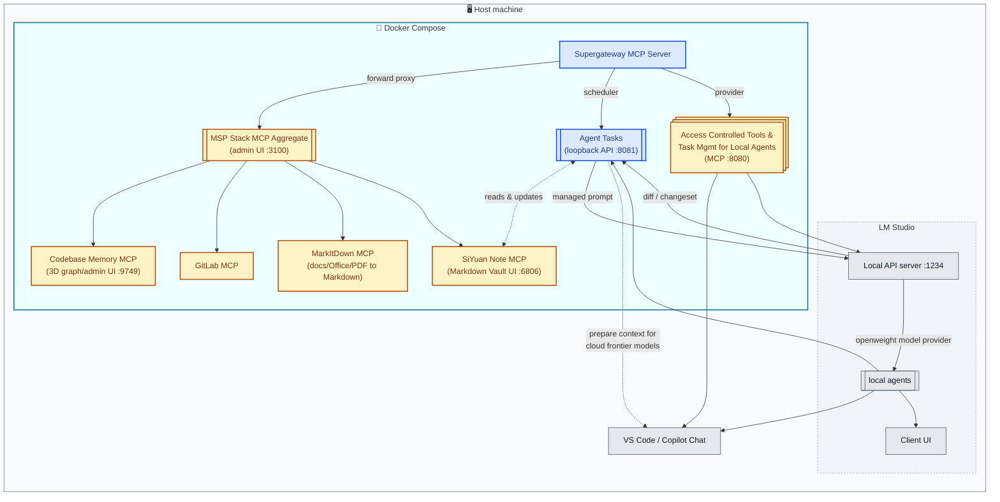

# VS Code MCP Supergateway

A centralized, multi-client Model Context Protocol (MCP) gateway that aggregates, routes, and offloads context between IDE clients, local LLM workers, and backend MCP services.

---

## 💡 Overview & Value Proposition

As MCP usage grows, managing multiple disjointed MCP servers across different clients (VS Code/Copilot, LM Studio, etc.) becomes cumbersome. **VS Code MCP Supergateway** acts as a unified hub:

1. **Multiplexing & Routing:** Connect multiple clients to a single, orchestrated MCP endpoint.
2. **Context & Token Savings:** Keep expensive Frontier Model context clean by delegating repetitive context-structuring tasks to local worker models.
3. **LM Studio Loopback Pattern:** Turn LM Studio into both an MCP consumer *and* a high-speed local MCP tool/worker for tasks like documentation linting, diff summarization, and task management.

---

## 🏗 Architecture

Everything except your IDE and LM Studio runs inside Docker — the containers bring their own Node.js, Python, and all four upstream MCP servers.



Legend: 🟦 blue = this repo's code entry points (click to open the source file) · 🟨 amber = third-party MCP servers/packages (click for npm/PyPI page) · ⬜ grey = host-side applications you already run (VS Code, LM Studio). Subgraph backgrounds: outer host boundary in slate, the LM Studio group dashed, the Docker Compose boundary in cyan.

---

## 🚀 Quick Start

### 1. Prerequisites

- [Docker](https://www.docker.com/) — Docker Desktop on Windows/macOS. **This is the only requirement.** Node.js, Python, and every upstream MCP server are bundled inside the image; nothing is installed on your host.
- [VS Code](https://code.visualstudio.com/) with GitHub Copilot — the client that will consume the gateway.
- [LM Studio](https://lmstudio.ai/) — optional, only for local model offloading & the loopback tools.

### 2. Clone and configure

```bash
git clone https://github.com/Flexi23/vscode-mcp-supergateway.git
cd vscode-mcp-supergateway
cp .env.example .env
```

Then edit [`.env`](.env.example):

| Variable | Required | Purpose |
|---|---|---|
| `GITLAB_PERSONAL_ACCESS_TOKEN` | for the `gitlab` upstream | Injected into the `gitlab` upstream by [`src/gateway.ts`](src/gateway.ts). Without it that upstream fails to connect and its tools are missing from the admin UI. |
| `SIYUAN_TOKEN` | for the `siyuan-note` upstream | SiYuan API token (SiYuan: Settings -> About -> API Token) for the `siyuan` Compose service. Without it the upstream can't authenticate against the SiYuan kernel. |
| `SIYUAN_ACCESS_AUTH_CODE` | **required** for the `siyuan` service | Lock-screen password for the `siyuan` container's own web UI (<http://localhost:6806>); the container refuses to start without it (or `SIYUAN_ACCESS_AUTH_CODE_BYPASS=true`). |
| `WORKSPACE_ROOT` | **required** | Absolute host path to the workspace root. The SiYuan workspace dir (`${WORKSPACE_ROOT}/vscode-mcp-supergateway/siyuan-workspace`) and the `codebase-memory` auto-index target (bind-mounted read-only at `/workspace` in the `gateway` container) are both derived from this single variable. |
| `LMSTUDIO_BASE_URL` | for the loopback tools | Defaults to `http://host.docker.internal:1234/v1`. Inside a container `localhost` means *the container*, so a host-side LM Studio must be reached via `host.docker.internal` (Docker Desktop only). |

### 3. Start

```bash
docker compose up -d --build
```

The first build takes a while and produces a ~2.9 GB image — see [🐳 Operations](#-operations) for why.

### 4. Connect VS Code

Point your MCP client config at the gateway's public port:

```json
{
  "servers": {
    "central-mcp-gateway": {
      "type": "sse",
      "url": "http://localhost:8080/sse"
    }
  }
}
```

Verify it came up:

```bash
curl http://localhost:8080/ping     # -> ok
docker compose logs gateway         # -> [upstream:*] connected (stdio) x4
```

The admin UI lives at <http://localhost:3100/admin>.

---

## 📦 Services & Ports

`gateway.ts` and `server.ts` run as a single Node process in a single container (`vscode-mcp-supergateway-backend:local`), started via `node dist/gateway.js` (see [`docker-compose.yml`](docker-compose.yml)). `gateway.ts` imports and starts `server.ts`'s Express app directly instead of spawning a second container.

| Port | What it is |
|---|---|
| `8080` | Public MCP endpoint — the forward proxy your MCP client (Copilot/LM Studio) connects to. |
| `3100` | `@mspstack/mcp-gateway` admin UI + direct MCP endpoint. |
| `8081` | Express LM Studio loopback backend (`lmstudio_complete`, `lmstudio_summarize_diff`, `lmstudio_update_siyuan_task`), started in-process via `startBackendServer()`. |
| `9749` | `codebase-memory-mcp`'s own 3D graph-visualization UI (<http://localhost:9749>). Its coordination daemon only binds `127.0.0.1` and rejects cross-origin browser requests, so `gateway.ts` enables it via `CBM_CACHE_DIR/config.json` and reverse-proxies the published port to it, rewriting `Origin`/`Referer` to satisfy its same-origin check; override the port with `CBM_UI_PORT`. |

The LM Studio loopback's `lmstudio_update_siyuan_task` tool reads/writes SiYuan documents directly via `SiyuanClient` (`src/services/siyuanClient.ts`), the same backend the `siyuan-note` upstream talks to (see [Configured Upstreams](#-configured-upstreams)).

### What is `@mspstack/mcp-gateway`?

[`@mspstack/mcp-gateway`](https://www.npmjs.com/package/@mspstack/mcp-gateway) ("MSPStack Gateway", MIT-licensed, by [Eugene Samotija](https://github.com/selic)) is a third-party, self-hosted MCP aggregator: it federates any number of MCP servers (stdio or HTTP) behind one endpoint with namespaced tools, and normally adds OAuth 2.1 / static-token auth, role-based tool access, and secret-store integration (OpenBao, Azure Key Vault) on top — built for MSPs running many client-facing MCP servers.

`src/gateway.ts` spawns it via `npx -y @mspstack/mcp-gateway --port <admin-port> --config <admin-config> --db-path <db>` and sets `DEV_ALLOW_UNAUTHENTICATED=true`, which puts it in its documented localhost-only, no-auth mode — we only use its core aggregation feature (one MCP endpoint for our four stdio upstreams), none of the OAuth/RBAC/secret-store machinery. `DEV_ALLOW_UNAUTHENTICATED=true` must **never** be used on anything but `127.0.0.1`/localhost; the package itself refuses to start without it or a real auth method configured. Requires Node ≥24 (uses the built-in `node:sqlite`, no native dependencies) — see the Node version note below.

---

## 🔌 Configured Upstreams

All four run inside the `gateway` container; the runtime column only says which language runtime the image provides for them.

| Upstream | Package | Runtime | Notes |
|---|---|---|---|
| `codebase-memory` | `codebase-memory-mcp` | Node | Auto-indexes `WORKSPACE_ROOT` (bind-mounted read-only at `/workspace`) on container startup via `CBM_AUTO_INDEX_PATH` (see [`src/gateway.ts`](src/gateway.ts)); own graph UI on port 9749 (see [Services & Ports](#-services--ports)), shared `CBM_CACHE_DIR` with the UI process. |
| `siyuan-note` | [`siyuan-mcp`](https://www.npmjs.com/package/siyuan-mcp) | Node | Talks to the `siyuan` Docker Compose service (`SIYUAN_HOST=siyuan`, port `6806`) over its REST API; requires `SIYUAN_TOKEN` (SiYuan: Settings -> About -> API Token, see [.env.example](.env.example)). |
| `gitlab` | `@zereight/mcp-gitlab` | Node | Requires `GITLAB_PERSONAL_ACCESS_TOKEN` (see [Quick Start](#2-clone-and-configure)). |
| `markitdown` | [`markitdown-mcp`](https://pypi.org/project/markitdown-mcp/) | Python | Exposes a single tool, `convert_to_markdown(uri)`, for `http:`, `https:`, `file:`, and `data:` URIs. |

Upstream wiring lives in [`docker/gateway.config.json`](docker/gateway.config.json). The `siyuan` service itself (image `b3log/siyuan`) is defined in [`docker-compose.yml`](docker-compose.yml) and also publishes its own web UI at <http://localhost:6806>; set `SIYUAN_ACCESS_AUTH_CODE` in `.env` to lock it down.

---

## ⚡ Key Features & Concepts

- **Unified Control Plane:** Connect Copilot and LM Studio simultaneously to your underlying toolchain (GitLab, Codebase Memory, SiYuan Note, MarkItDown).
- **Sub-Agent Loopback:** Offload context aggregation, diff generation, and documentation updates to fast local models running in LM Studio without consuming cloud tokens.
- **SiYuan Note Integration:** Read and edit notebooks, documents, content blocks, and native databases in a running SiYuan instance through the `siyuan-note` upstream.
- **Document Conversion:** [MarkItDown](https://github.com/microsoft/markitdown) upstream exposes `convert_to_markdown(uri)`, turning PDFs, Office documents, images, and other files into Markdown for downstream agent consumption.

---

## 🐳 Operations

```bash
docker compose up -d --build   # start (rebuilds if needed)
docker compose logs -f gateway # follow gateway logs
docker compose down            # stop and remove
```

Notes:
- **Data persistence:** the gateway DB lives in the `gateway-data` named volume (not a bind mount) — inspect with `docker compose exec gateway sh`. The SiYuan workspace is a host bind mount derived from `WORKSPACE_ROOT` (see [.env.example](.env.example)), so it's directly inspectable/backupable on the host.
- **Node ≥24 required:** `@mspstack/mcp-gateway` declares it in its `engines` field, so [`Dockerfile`](Dockerfile) uses `node:24-alpine` (builder) / `node:24-bookworm-slim` (runtime). Do not downgrade to `node:20`.
- **Image size (~2.9 GB):** caused by Python's `markitdown[all]` (onnxruntime, pandas, azure SDKs, ...) plus ~330 Node packages. Accepted trade-off for having zero host-level dependencies.

---

## 🛠 Developing on this repo

Only relevant if you change the TypeScript sources. The image compiles `src/` itself during `docker compose build`, so you never need a host-side build to *run* anything — a local install is purely for editor IntelliSense and fast type-check feedback:

```bash
npm install          # type definitions for your editor
npx tsc --noEmit     # type-check without producing dist/
```

Then rebuild the image to pick up your changes:

```bash
docker compose up -d --build
```

---

## 🗺 Roadmap & Future Plan

### Phase 1: MVP & Core Gateway (Current)
- [x] Basic stdio / SSE transport routing.
- [x] Multi-backend server orchestration (Codebase Memory, GitLab, SiYuan Note).
- [x] Initial agent-assisted development groundwork.

### Phase 2: LM Studio Loopback & Context Worker
- [ ] Implement local LM Studio MCP tool wrapper (`summarize_diff`, `generate_adr`).
- [ ] Add zero-blocking async tool handling for local inference.
- [ ] Graceful fallback & timeout management when local GPUs are under heavy load.

### Phase 3: SiYuan Note & Task Management Enhancements
- [ ] Structured task/ADR documents in SiYuan, driven by the `siyuan-note` upstream and `lmstudio_update_siyuan_task`.
- [ ] Agent scope security layer (permission checks around destructive SiYuan operations).
- [ ] Automated context bundle generator for Copilot prompts.

---

## 📄 License

MIT License. Feel free to contribute or adapt!

---

## 🧪 Disclaimer

Parts of this repository were deliberately generated with small local LLMs rather than a single frontier model — quality and style vary accordingly between commits. This includes the preserved original prototype created by Gemma 4 12B, which was saved on its own branch before the Docker refactor and later merged back into `main` for provenance. See individual commit messages for which model produced each change.