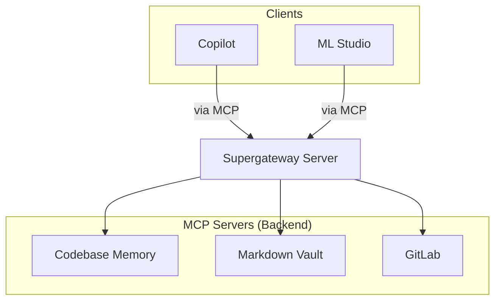

# Welcome to vscode-mcp-supergateway

## Overview

This is the main documentation for the `vscode-mcp-supergateway` project. It outlines the purpose and functionality of the project. The system utilizes Model Context Protocol (MCP) to aggregate various services into a unified interface, enabling them to be used together by AI tools like Copilot and Cline. More information about the core technology can be found at [supergateway](https://github.com/supercorp-ai/supergateway).

### Project Purpose
The `vscode-mcp-supergateway` project serves as a gateway layer that bridges Model Context Protocol (MCP) servers with VS Code's MCP integration. It allows AI assistants (such as Copilot and Cline) to access and orchestrate multiple backend services through a single unified interface.

## Directory Structure

The project follows a modular architecture organized into several key directories:

### `vscode/`
Contains workspace-specific configuration files for the VS Code MCP integration:
- `mcp.json` – Defines the MCP server registration and communication endpoints. This file configures the HTTP proxy server, specifies port 8083, defines MCP endpoint paths, and registers backend services (local LLMs, knowledge bases, tool integrations).
- `settings.json` – Global settings for the MCP proxy server. Includes logging configuration, timeout values, connection pooling settings, and performance thresholds.
- `tasks.json` – Task definitions and workflow configurations. Defines reusable task templates for common operations such as model loading, service orchestration, and cleanup routines.
- `supergateway.js` – HTTP Proxy Server that exposes stdio-based MCP servers over HTTP (see below). This is the core component that bridges MCP protocol communication with standard HTTP/HTTPS access for AI clients.

### `.clinerules/`
Contains agent rule configurations and behavior guidelines:
- `vscode-mcp-supergateway.md` – Core instructions for AI agents operating within this environment (mandatory compliance rules)

### `AGENT_INSTRUCTIONS.md`
Defines best practices, role guidelines, and operational constraints for all AI agents that interact with the supergateway. All agent behavior must strictly adhere to these guidelines.

### `CHANGELOG.md`
Tracks semantic versioning updates and release history.

## MCP Proxy Server (`supergateway.js`)

This component implements an **HTTP Proxy Server** that acts as a gateway for Model Context Protocol (MCP) communication. It bridges stdio-based MCP server communication with HTTP access, enabling AI tools like Copilot and Cline to interact with aggregated services through a web interface.

### Key Functionalities

1. **HTTP Server On Port 8083**
   - Starts an HTTP server on port `8083` at the path `/mcp`
   - Listens for incoming MCP protocol requests from AI clients (Copilot, Cline, etc.)
   - Serves as the primary entry point for external integration
   - Handles concurrent connections using async/await patterns

2. **MCP Message Proxy**
   - Parses MCP message streams using `parseMcpMessages()` functions
   - Normalizes data between XML and JSON formats via utility functions like `xmlToJson()`, `jsonToXml()`
   - Validates message types (command, query, result) and routes them to appropriate backend services
   - Implements error handling for malformed MCP messages

3. **STDIO Bridging**
   - Interfaces with external processes through stdio (command-line arguments and stdin/stdout)
   - Allows the gateway to launch and manage local MCP servers as subprocesses
   - Provides a standardized interface for AI tools to invoke backend services via shell commands
   - Supports streaming output capture from background processes

4. **Service Orchestration**
   - Coordinates between multiple MCP backends (local LLMs, knowledge bases, tool integrations)
   - Manages request routing and response aggregation across distributed services
   - Implements circuit breaker patterns for failing services
   - Handles load balancing across available service instances

### HTTP Endpoints

The proxy exposes the following standardized MCP endpoints:
- `POST /mcp/query` – Submit a query to the gateway; returns results as JSON
- `GET /mcp/status` – Query the server's health and status
- `PUT /mcp/config` – Update configuration at runtime (port, timeouts, endpoint URLs)

## Integration Flow


## Installation and Setup

### Prerequisites
- **VS Code** with MCP extension installed
- **LM Studio** (for local LLM support)
- Node.js and npm (for the proxy server)
- PowerShell (for model pulling script)

### Steps
1. **Clone the repository**
   ```bash
   git clone https://github.com/supercorp-ai/vscode-mcp-supergateway.git
   cd vscode-mcp-supergateway
   ```

2. **Install Dependencies**
   ```bash
   npm install
   ```

3. **Start the Gateway Server**
   The server is automatically started when VS Code launches, provided the configuration files (`mcp.json`, `settings.json`) are present in the `.vscode/` directory.
   - Ensure port 8083 is available on your system
   - Verify that required environment variables are set (e.g., OLLAMA_MODEL_PATH)

4. **Pull Ollama Models (optional)**
   To use local LLMs with the gateway:
   ```bash
   ollama pull gemma4:12b  # or any other model
   ```
   This registers the model in the `pull-ollama-models.ps1` script and makes it available to the MCP proxy.

## Gateway Integration with LM Studio

The supergateway is designed to work seamlessly with VS Code Copilot and LM Studio for local language model inference. 

#todo: explain how to add Supergateway to LM Studio under "Connected Apps"

## Agent Guidelines (`AGENT_INSTRUCTIONS.md`)

All agent behavior and operations must strictly adhere to the guidelines specified in `vscode-mcp-supergateway/AGENT_INSTRUCTIONS.md`. These instructions represent mandatory constraints for all execution steps. Key areas covered include:
- Role definition and scope of operation
- Data handling and privacy requirements
- Error handling and fallback behaviors
- Compliance with security policies
- Communication protocols with the MCP gateway

## MCP Servers Overview

The supergateway aggregates multiple services through a unified MCP interface. Each service (e.g., local LLMs, knowledge bases, tool integrations) exposes its capabilities via standard MCP message types. The gateway orchestrates these services to provide a cohesive experience for AI assistants.

Supported backend service types:
- **LLM Services** – Local Ollama models (gemma4:12b, etc.) exposed as model-compatible MCP servers
- **Knowledge Bases** – RAG endpoints that serve structured documents and Q&A
- **Tool Integrations** – External APIs wrapped as MCP-compatible services

## Troubleshooting

Common issues and solutions:

- **Server not starting** – Verify `mcp.json` is correctly configured and that ports 8080-8083 and 3100 are available.
- **MCP connection refused** – Ensure the gateway's HTTP server is running and accessible at `http://localhost:8083/mcp`.
- **Agent compliance errors** – Review `AGENT_INSTRUCTIONS.md` for required behavior constraints.

## License

This project follows the standard open-source license agreed upon by all contributors.