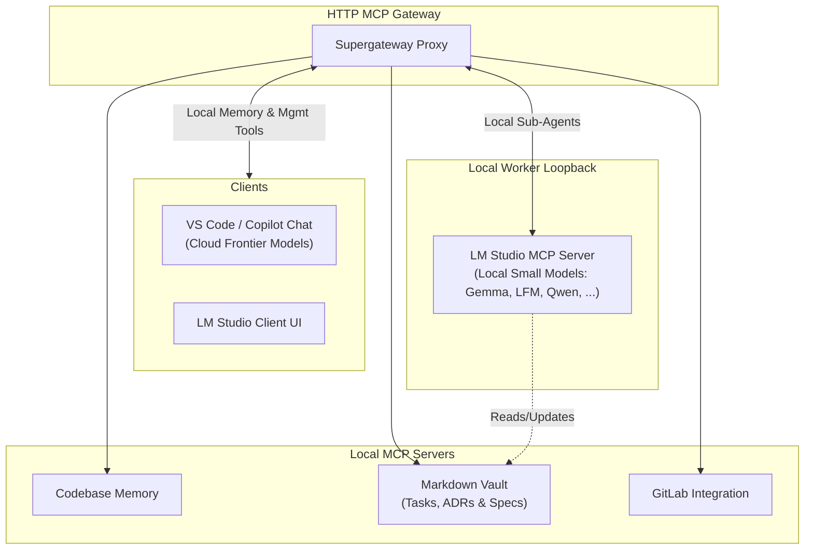

# VS Code MCP Supergateway

A centralized, multi-client Model Context Protocol (MCP) gateway that aggregates, routes, and offloads context between IDE clients, local LLM workers, and backend MCP services.

---

## 💡 Overview & Value Proposition

As MCP usage grows, managing multiple disjointed MCP servers across different clients (VS Code/Copilot, LM Studio, etc.) becomes cumbersome. **VS Code MCP Supergateway** acts as a unified hub:

1. **Multiplexing & Routing:** Connect multiple clients to a single, orchestrated MCP endpoint.
2. **Context & Token Savings:** Keep expensive Frontier Model context clean by delegating repetitive context-structuring tasks to local worker models.
3. **LM Studio Loopback Pattern:** Turn LM Studio into both an MCP consumer *and* a high-speed local MCP tool/worker for tasks like documentation linting, diff summarization, and task management.

---

## 🏗 Integration Flow



---

## ⚡ Key Features & Concepts

- **Unified Control Plane:** Connect Copilot and LM Studio simultaneously to your underlying toolchain (GitLab, Codebase Memory, Vault).
- **Sub-Agent Loopback:** Offload context aggregation, diff generation, and documentation updates to fast local models running in LM Studio without consuming cloud tokens.
- **Markdown Vault Integration:** Structure project tasks, architectural decision records (ADRs), and feature specs directly in markdown files guarded by YAML access controls (`agent_access`).

---

## 🚀 Getting Started

### Prerequisites
- Node.js 20+
- [VS Code](https://code.visualstudio.com/) with GitHub Copilot
- [LM Studio](https://lmstudio.ai/) (optional, for local model offloading & loopback)

### Installation
```bash
git clone https://github.com/Flexi23/vscode-mcp-supergateway.git
cd vscode-mcp-supergateway
npm install
npm run build
```

---

## 🗺 Roadmap & Future Plan

### Phase 1: MVP & Core Gateway (Current)
- [x] Basic stdio / SSE transport routing.
- [x] Multi-backend server orchestration (Codebase Memory, GitLab, Vault).
- [x] Initial agent-assisted development groundwork.

### Phase 2: LM Studio Loopback & Context Worker
- [ ] Implement local LM Studio MCP tool wrapper (`summarize_diff`, `generate_adr`).
- [ ] Add zero-blocking async tool handling for local inference.
- [ ] Graceful fallback & timeout management when local GPUs are under heavy load.

### Phase 3: Vault & Task Management Enhancements
- [ ] Standardized YAML-Frontmatter parser for Markdown Vault (`tasks/`, `adrs/`).
- [ ] Agent scope security layer (`agent_access: read | append | edit | hidden`).
- [ ] Automated context bundle generator for Copilot prompts.

---

## 📄 License

MIT License. Feel free to contribute or adapt!